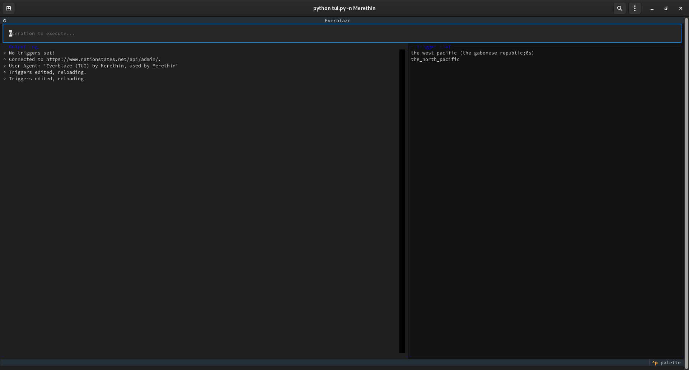
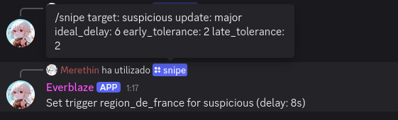
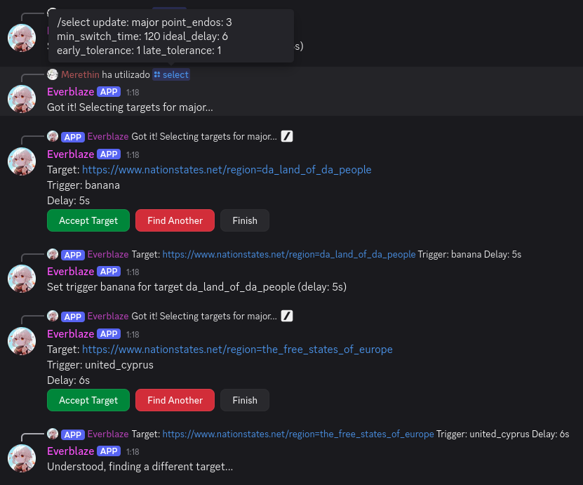
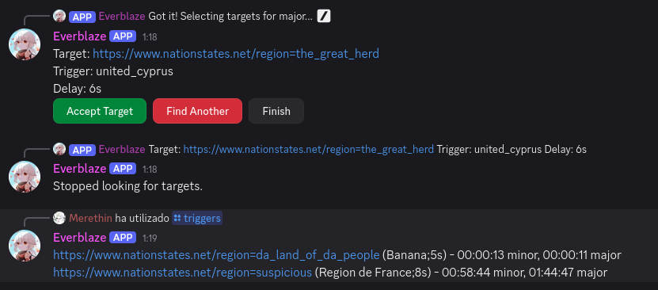

# Everblaze

Everblaze is a set of open-source triggering tools for the NationStates R/D game, using the new server-sent events API.

It comes in two variants: an [interactive terminal program for individual use](tui.py) ([click here to read its documentation](docs/tui.md)) and a [versatile Discord bot for server use](bot.py) ([click here to read its documentation](docs/discord.md)).

Features:
- Fully interactive; triggers can be removed, added, found, etc. at runtime, mid-update.
- Triggers can be loaded from a file (TUI version only), or can all be added at runtime.
- Can find any number of raidable/taggable regions for you automatically (Discord version only, similar to QuickDraw).
- Can be used in separate channels with their own unique trigger lists, and the raidable region finder will only pick regions that have not been picked in any other channel (Discord version only).
- Can find a suitable trigger for any given region at runtime (both versions).
- Supports setting both standalone trigger regions and targets with associated triggers.
- Using SSE, it has a lower overhead than tools that poll the API, and can do a lot more than traditional tools.
- Minimal API calls - Everblaze relies only on the daily data dumps and server-sent events.

**Everblaze runs on Python 3.13. I have not tested earlier Python versions for compatibility. If things don't work, you may have to upgrade your Python version/install a new one.**

## Screenshots

### TUI version


### Discord bot

#### Finding triggers at runtime


#### Searching for raidable/taggable regions



## Common setup (for both variants)

It is highly recommended, but not mandatory, to use a Python virtual environment to use this tool.

```
$ python -m venv venv
```

On Linux, the virtual environment can be entered with
```
$ source venv/bin/activate
```
and left with:
```
$ deactivate
```

Once that's done, install the required packages with `pip`:
```
pip install -r requirements.txt
```

## Contact

If you have any questions about this tool, contact me using one of the following:

NationStates telegrams: https://nationstates.net/nation=merethin

Discord: @ns_merethin

## Disclaimer
This program is provided as-is with no guarantees of legality or compliance with the NationStates API rules. While I have tried my best to comply with them, it is the responsibility of every user to understand and insure the scripts they run are legal. You assume all risks.

## Licensing
This program is provided freely under the [BSD-2-Clause](LICENSE) license. Open-source is love <3